# Roguelite 👾
## Projeto de LI2

Jogo desenvolvido em C por nós no âmbito da Unidade Curricular de **Laboratórios de Informática II** (**LI2**) no ano letivo de 2022/2023. Trata-se de um jogo roguelite, inspirado no jogo [Brogue](http://brogue.roguelikelike.com/).

### Nota final: 18/20 ✅

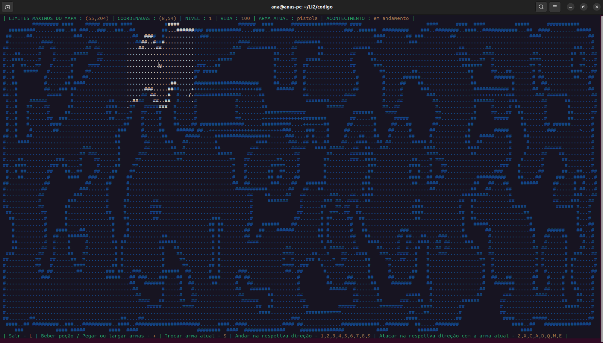

## Como jogar?
### Requisitos:
- Sistema operativo: Linux
- GNU Make instalado
- GCC (GNU Compiler Collection) instalado
- Biblioteca ncurses instalada
### Comandos:
```
git clone git@github.com:a104437ana/LI2.git
```
```
cd LI2
```
```
cd codigo
```
```
make clean
```
```
make
```

> [!IMPORTANT]
> Maximizar o terminal para uma melhor experiência!


```
./jogo
```

### Objetivo:
O objetivo do jogo é avançar o máximo possível pela caverna, tentando alcançar o maior nível antes de morrer.

Não há um fim definido — quanto mais você avançar, maior será o seu recorde.

A entrada para o próximo nível da caverna é sempre o caractere `/`.

Tente encontrá-lo enquanto ainda estiver vivo!

Neste jogo, o tempo não é um fator. Podes pensar com calma e demorar o tempo que quiseres antes de tomar a tua próxima ação. A chave está na estratégia, na observação e no cuidado a cada passo.

### Teclas:
Tal como diz na barra inferior do jogo:
- Sair do jogo: `L` ou `l`
- Beber poção / Pegar e/ou largar armas: `+`
- Trocar arma atual: `S`ou `s`
- Andar na respetiva direção:
    - Sudoeste: `1`
    - Sul: `2` ou ⬇️
    - Sudeste: `3`
    - Oeste: `4` ou ⬅️
    - Ficar parado: `5`
    - Este: `6` ou ➡️
    - Noroeste: `7`
    - Norte: `8` ou ⬆️
    - Nordeste: `9`
- Atacar na respetiva direção:
    - Sudoeste: `Z` ou `z`
    - Sul: `X` ou `x`
    - Sudeste: `C` ou `c`
    - Oeste: `A` ou `a`
    - Este: `D` ou `d`
    - Noroeste: `Q` ou `q`
    - Norte: `W` ou `w`
    - Nordeste: `E` ou `e`

> [!TIP]
> Utilizar um teclado númerico para uma melhor experiência!

### Estado do jogo

Na barra superior do jogo temos várias informações sobre o jogador e o seu estado atual:
- O **nível** da caverna onde o jogador se encontra atualmente. Começa no nível `1` e vai aumentando, à medida que avanças na caverna.
- A **vida** do jogador que varia entre os valores de `0` e `100`. Se a vida chegar a 0 ou menos, o jogador morreu.
- A **arma atual** do jogador, que pode ser `corpo`, `pistola` ou `faca`. O jogador tem sempre o corpo e pode ter mais uma arma (pistola ou faca) consigo.
- O **acontecimento** mais recente do jogador. Exemplos de acontecimentos são `foi atacado por um monstro`, `deu um tiro e acertou`, `deu um tiro e não acertou`, entre muitos outros...

### Jogador e Locais

| 📸 Imagem| 🅰️ Carácter | 🔍 Significado | ℹ️ Informação | 🎨 Cor |
|:---------:|:---------:|:---------:|:---------:|:---------:|
|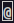| `@` | Jogador | Representa a posição atual do jogador | ⚪ |
|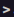| `>` | Entrada | Entrada do nível atual da caverna (não é importante) | ⚪ |
|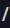| `/` | Saída | Saída do nível atual / Entrada do próximo — aquilo que procuras no mapa (importante) | ⚪ |

### Armas

| 📸 Imagem| 🅰️ Carácter | 🔍 Significado | ℹ️ Informação | 🎨 Cor |
|:---------:|:---------:|:---------:|:---------:|:---------:|
|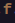| `f` | Faca | Usada apenas quando o monstro está ao lado | 🟤 |
|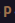| `p` | Pistola | Pode ser usada à distância | 🟤 |

### Monstros

| 📸 Imagem| 🅰️ Carácter | 🔍 Significado | ℹ️ Informação | 🎨 Cor |
|:---------:|:---------:|:---------:|:---------:|:---------:|
|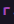| `r` | Rato (rat) | Tira vida ao ficar ao lado do jogador | 🟣 |
|| `d` | Cão (dog) | Tira vida ao ficar ao lado do jogador | 🟣 |
|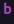| `b` | Morcego (bat) | Tira vida ao ficar ao lado do jogador | 🟣 |

### Outros elementos
| 📸 Imagem| 🅰️ Carácter | 🔍 Significado | ℹ️ Informação | 🎨 Cor |
|:---------:|:---------:|:---------:|:---------:|:---------:|
|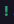| `!` | Poção | Aumenta a vida (na maioria das vezes), mas pode causar dano (mais raro mas possível) | 🟢 |
|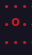| `o` e `.` | Bomba | Pode explodir e tirar vida ao ser ativada | 🔴 |

#### É difícil descrever totalmente este jogo com palavras — a melhor forma de o entender... é jogando.

#### Boa sorte! 🍀

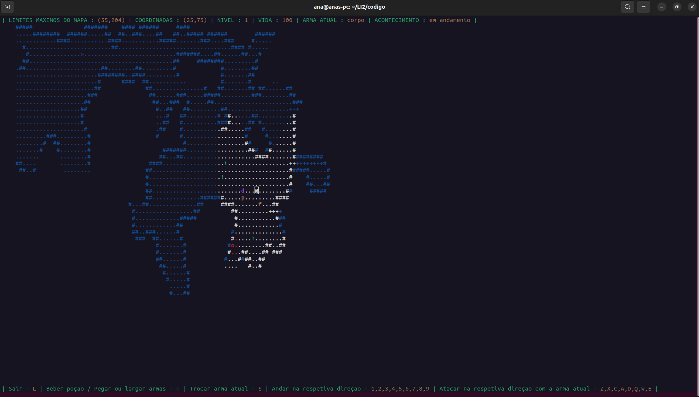
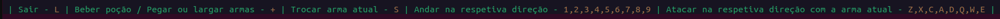

## Comparação
| O nosso Roguelite                    | O Brogue                   |
|:-----------------------------:|:------------------------------:|
| 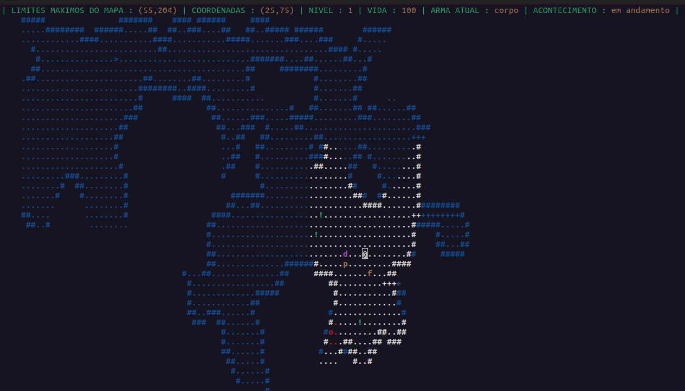     |      |

## Autores
### Grupo 54
- [Ana Sá Oliveira](https://github.com/a104437ana) (A104437)
- Beatriz Carvalho Peixoto (A104170)
- Sara Campos Ramalho (A72481)